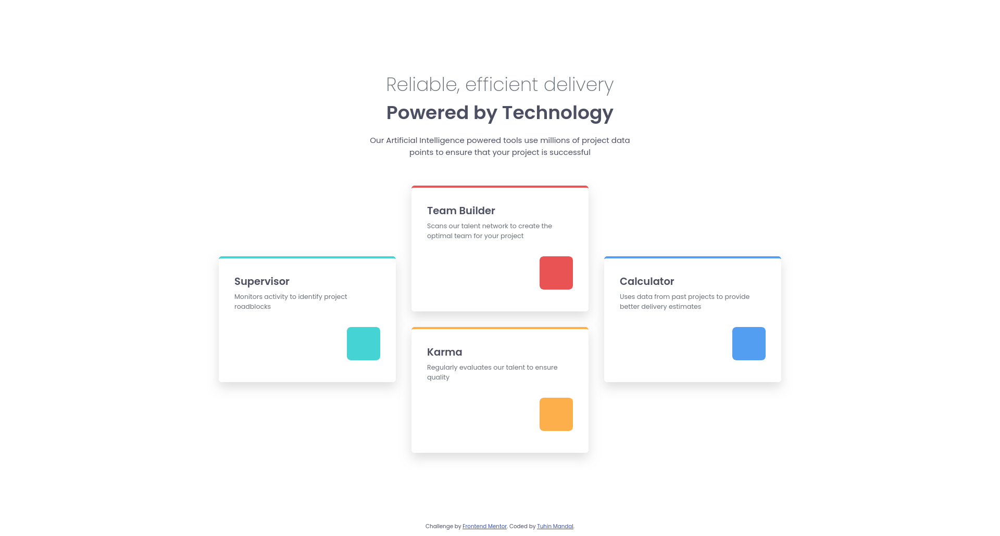

# Frontend Mentor - Four card feature section solution

This is a solution to the [Four card feature section challenge on Frontend Mentor](https://www.frontendmentor.io/challenges/four-card-feature-section-weK1eFYK). Frontend Mentor challenges help you improve your coding skills by building realistic projects.

## Table of contents

- [Overview](#overview)
  - [The challenge](#the-challenge)
  - [Screenshot](#screenshot)
  - [Links](#links)
- [My process](#my-process)
  - [Built with](#built-with)
  - [What I learned](#what-i-learned)
  - [Continued development](#continued-development)
  - [Useful resources](#useful-resources)
- [Author](#author)
- [Acknowledgments](#acknowledgments)

## Overview

### The challenge

Users should be able to:

- View the optimal layout for the site depending on their device's screen size

### Screenshot



### Links

- Solution URL: [My solution](https://www.frontendmentor.io/solutions/four-card-feature-section-responsive-css-grid-and-custom-properties-lpW8HEKuCk)

- Live Site URL: [Live site](https://four-card-feature-section-main-tm.netlify.app/)

## My process

### Built with

- Semantic HTML5 markup
- CSS custom properties
- Flexbox
- CSS Grid
- Mobile-first workflow

### What I learned

- I learnt about grid layout and about grid lines and how to use them for placing items in a grid.
- I learnt about grid-template-areas and this allowed me to solve this problem elegantly and more intuitively.

```css
.grid-container {
  display: grid;
  gap: 2rem;
  grid-template-areas:
    "supervisor"
    "teambuilder"
    "karma"
    "calculator";
}
.supervisor {
  grid-area: supervisor;
}

.team-builder {
  grid-area: teambuilder;
}

.karma {
  grid-area: karma;
}

.calculator {
  grid-area: calculator;
}

@media (min-width: 68.6875em) {
  .grid-container {
    grid-template-areas:
      "supervisor teambuilder"
      "karma calculator";
  }
}
```

### Continued development

I will be learning and using CSS Grid more and more in my future projects. It really solves 2D layouts very efficiently and elegantly.

### Useful resources

- [MDN Web Docs](https://developer.mozilla.org/en-US/) - This helped me for understanding web standards and best practices.
- [CSS Tricks](https://css-tricks.com/) - This is an amazing article which helped me finally understand CSS Grid.

## Author

- Website - [Tuhin Mandal](https://tuhin-mandal-portfolio.vercel.app/)
- Frontend Mentor - [@tuhinmandal](https://www.frontendmentor.io/profile/mandaltuhin)

## Acknowledgments

- [Frontend Mentor](https://www.frontendmentor.io/) - For providing the challenge and resources to improve my skills.
